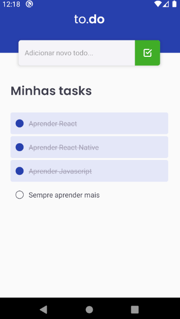

# Grupo2-DevMob


**Um app no formato Todo-List**


Este app foi criado para o bootcamp da Rocketseat em 2021.1 e todo código fonte é de acesso livre.

---
## Pré-requisitos para rodar o sistema
Para rodar o sistema será necessário instalar o [node](https://nodejs.org/en/ "Clique e veja como baixar o node") e as dependência dos React Native [Expo](https://react-native.rocketseat.dev/ "Clique e veja como baixar o React Native").
## Rodando o projeto
````git
$ git clone https://github.com/AdeLuigi/conceitos-react-native.git
$ cd conceitos-react-native
$ yarn install
````
**Neste momento app já deve estar pronto para rodar**
````git
$ yarn android
````

**Caso queira conferir os testes, você pode colocar o seguinte comando no terminal**
````git
$ yarn jest
````